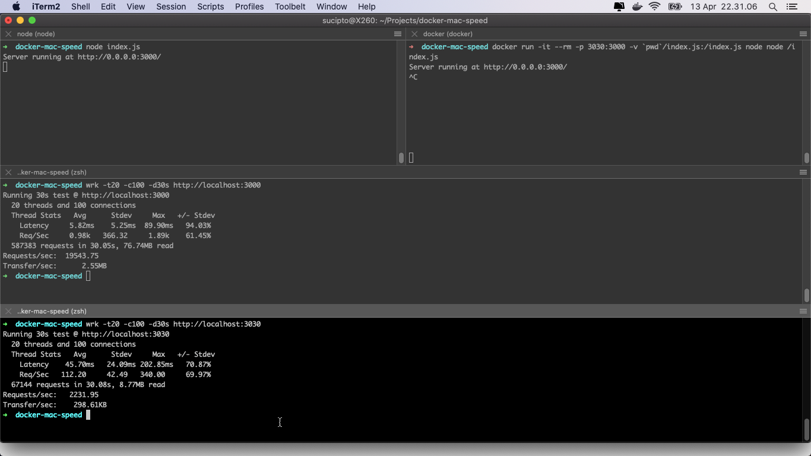

# Docker Mac Desktop vs Native Speed Comparison

# NodeJS installed on System
- node index.js
- wrk -t20 -c100 -d30s http://localhost:3000

# NodeJS on Docker
- docker run -it --rm -p 3030:3000 -v `pwd`/index.js:/index.js node node /index.js
- wrk -t20 -c100 -d30s http://localhost:3030

